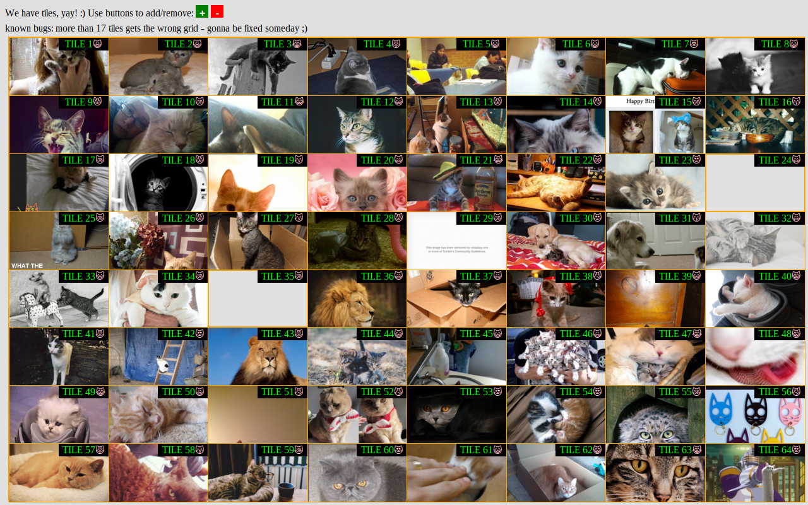

## basic description

This is a layout manager for native grids in the browser, similar to what a tiling window manager typically does.
Native grids are experimental for now. Use Chrome and set some flag to try, see (http://caniuse.com/#feat=css-grid).

IE is not yet supported, could be done easily by adding the -ms- prefix though.
Swapping / moving tiles is not yet supported.
Removing any but the last tile is not yet supported.
Resizing single tiles is not supported and not planned.

Demo: (http://htmlpreview.github.io/?https://github.com/orangecms/cat/blob/master/grilama/grilama.html)

Would love to be used one day, e.g. in combination with Web Elements.

#### preview

#### current features

- generate quadratic or rectangular grid, based on number of tiles
- adjust to portrait / landscape sized parent
- add and remove tiles
- query thecatapi.com for awesome background images

#### TODO

- more abstraction
- fix bugs, 17+ tiles introduces some issues...
- implement what's not yet supported, see above

#### LICENSE

 WTFPL (http://www.wtfpl.net/)

#### DISCLAIMER

Only for demo purpose. Use at own risk. Bla.
